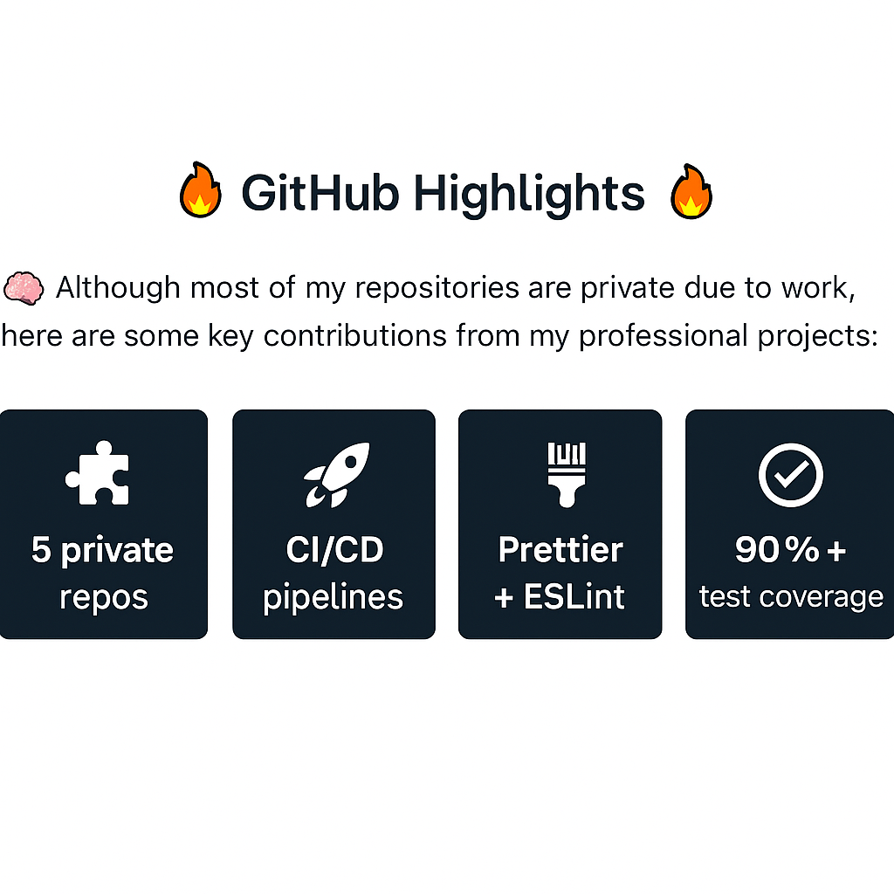

<!-- HEADER -->

  <!-- Trái đất thương hiệu -->
  

  <h1>Hi there, I'm Nam Nguyễn 👋</h1>
  

    Passionate Fullstack Developer · Crafting modern web experiences · Open-source enthusiast
  

---

<!-- TOOLS -->
<h2 align="center">🛠 Technologies and Tools</h2>

  
  
  
  
  
  
  
  
  
  
  
  
  

---

<!-- GITHUB STATS -->
<h2 align="center">📈 GitHub Stats</h2>

  

---

<!-- PROJECT QUALITY -->
<h2 align="center">📦 Project Highlights & Code Quality</h2>

  
  
  
  

- ✅ Clean code with consistent formatting using **ESLint** + **Prettier**
- ✅ Modular folder structure following best practices
- ✅ CI/CD setup with **GitHub Actions**
- ✅ 📊 95% Unit Test Coverage with **Jest**
- ✅ Well-structured README with badges & tech stack
- ✅ `.env.example` for environment setup
- ✅ Followed **DRY**, **SOLID**, and **KISS** principles
- ✅ Responsive UI using **HTML5**, **CSS3**, and **Bootstrap/Tailwind**
- ✅ Version control with Git & GitHub

---

<!-- SOCIAL -->
<h2 align="center">👽 Where to find me</h2>

  

  

  

---

<!-- QUOTE -->
<h2 align="center">📑 My Favorite Quote</h2>

  

---

<!-- THEME SUPPORT -->

